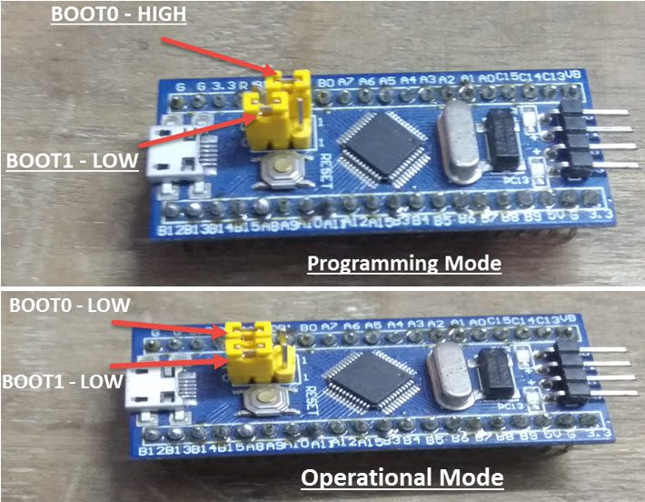

# STM32 + Arduino IDE + STLink + HID Bootloader / STM32 + STLink + CubeIDE
This repo is about how I manage to program an STM32 using Arduino IDE. As I may forget in the future. I used STM32 F103C8T6 Blue Pill.

## Requirements
### Hardwares 
1. STM32 F103C8T6
2. STLink v2 (this is used to flash the bootloader)
3. USB cable (after flashing using USB we need to upload the code) 
   *only for Arduino IDE, STLink V2 is enough for Cube IDE
### Softwares
4. Arduino IDE.
5. [STM32 STLink Utility](https://www.st.com/en/development-tools/stsw-link004.html)
### Drivers
6. [VCP(Virtual COM Port) Driver](https://www.st.com/en/development-tools/stsw-stm32102.html)
7. [HID bootloader and stm32 binaries](https://github.com/Serasidis/STM32_HID_Bootloader/releases)

## Steps
1. Set Boot0 pin to 1 on STM32.

2. Install the STLink Utility Software. Download the STM32 binaries and unzip them.
3. Now open the Stlink utility. Connect to the board. Select the binary file based on the board's built in led. Since Mine has built in led on PC13 I chose hid_generic_pc13.bin from F103/low_and_medium_density.
4. Click Program & Verify. After finished. Don't unplug or reset the board. Put the Boot0 back to 0.
5. STM32 set up is done. Now unplug STLink V2 and connect with USB. Open arduino ide. Go to Files > Preferences. Add `https://raw.githubusercontent.com/stm32duino/BoardManagerFiles/main/package_stmicroelectronics_index.json` in Additional board manager URLs.
6. Go to board manager, search STM32 and install **STM32 MCU based boards** by STM32electronics. 
7. Select blink sketch from example. At the top of the sketch add:
```
#define LED_BUILTIN PC13
```
8. Select the Tool > Boards. In my case **Generic STM32F1 Series**.\
Select the COM Port\
Upload Method: **HID Bootloader 2.2**\
USB Support: **CDC (Generic Serial Supersede U(S)ART)**
9. Press Upload. Hope it is uploaded. If not, good luck with debugging.

## Cube IDE
While creating a project do not choose C++ as coding language, choose C; otherwise code will not be generated in STM32Cube IDE. 
BOOT0 and BOOT1 must be 0 during code upload in Cube IDE. 
STLink will be used to upload the code, USB is not necessary.
